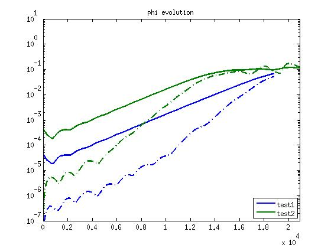
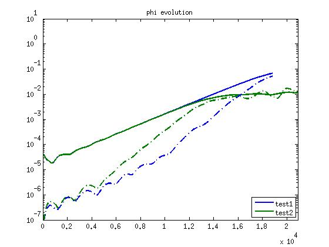
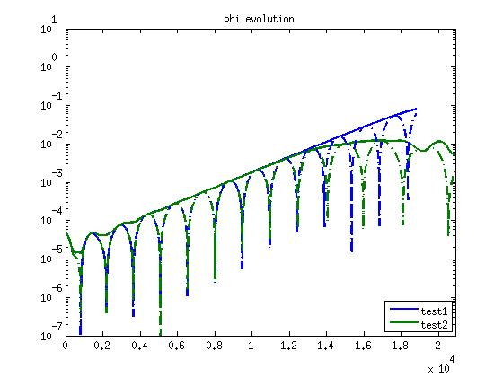
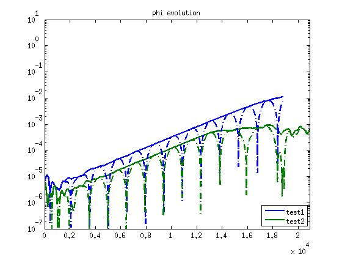

GTC-history-compare
===================

The codes in matlab that reads in GTC history.out files from different runs and making plots that compares the results. If you have any comments/questions, please contact me at *zhixuanw@uci.edu*.

# Files

## read_history.m
    
    function A=read_history(n_history,method)

This function reads several history.out files from different GTC runs, returns a matlab structure containing all the information. 

*  The argument n_history (*required*) is an integer indicating the number of history.out you want to read in.
*  The argument method (*optional*) indicates the way you want to select the history.out. 

    *    `method=1` picks the default places (`./history.out`) specified in the code
    *    `method=2` picks the files manually through graphic UI
    *    If not specified, the default value is `method = 1`.

## history_compare.m

    function history_compare(history,nfield, scales, outputtype, mmode)

This function generates plot comparing the history output from different GTC runs, returns nothing.

* "history" (*required*) is a structure generated by read_history
* "nfield" (*optional*) is the field you want to diagonose. The default fields are: 
    * 1. phi          2. apara           3. fluidne
    * If not specified, the default value is `nfield=1`.
* "scales" (*optional*) should be 
    * either a vector with the same length as "history",
    * or a single number, indicating every history output has the same scale/
    * If not specified, `scales = ones(n_history,1)` by default
* "outputtype" (*optional*): 
    * 0. plot the non-zonal and zonal RMS values    
    * 1. plot the amplitude and real-part of a specific m-harmonic
    * If not specified, `outputtype = 1` by default
* "mmode" (*optional*) specifies the m-harmonic we plot if outputtype = 1
    * either a vector with the same length as "history",
    * or a single number, indicating we plot the same m-harmonic for every history output
    * If not specified, we choose the 4th component by default    
    
# Usage Example

    >> h = read_history(2,2); % read in two history outputs by manually choosing them.
    >> File  1: /path1/history.out
    >> steps:  2400 n_species: 2 n_fields: 3 t_step: 7.838090e+00 
    >> File  2: /path2/history.out
    >> steps:  1600 n_species: 2 n_fields: 3 t_step: 1.306350e+01  
    >> history_compare(h) % compare the zonal and non-zonal phi RMS history
   

    >> history_compare(h,1,[1,0.1]]) % apply a 0.1 scale to the second history 
       

    >> history_compare(h,1,[1,0.1]], 1) % plot a single m-harmonic 
       

    >> history_compare(h,1,[1,0.1]], 1, [2,6]) % plot different m-harmonics from two histories
       
     

# Additional Comments: 

* Each tags are specified with a tag, the folder name by default. They will appear as legend in the plot generated by `history_compare`. You can specify those tags yourself.

* Apparently the color scheme is not that pleasant. I just use the matlab default values. You are welcome to custermize it if you want.

* I have not implemented the functionality to plot the particle history from GTC history.out yet. Probably one day I will update it. 

* It will be greatly appreciated if you want to contribute. Please feel free to contact me at *zhixuanw@uci.edu*

